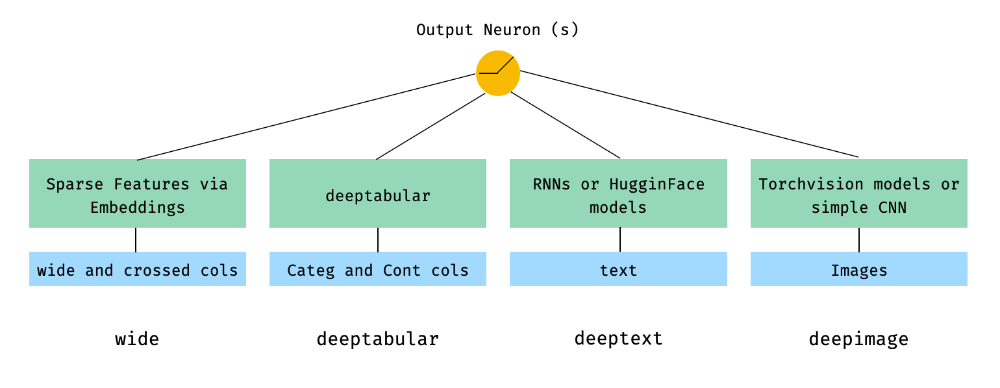
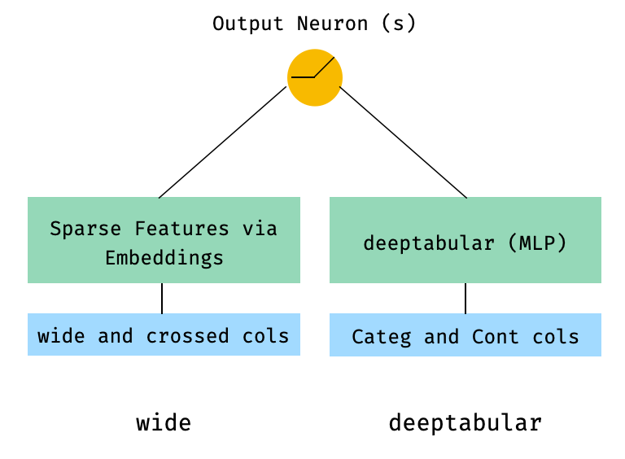
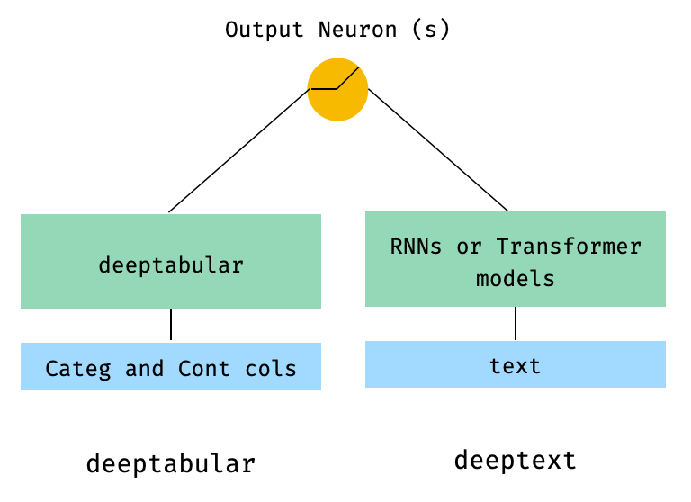
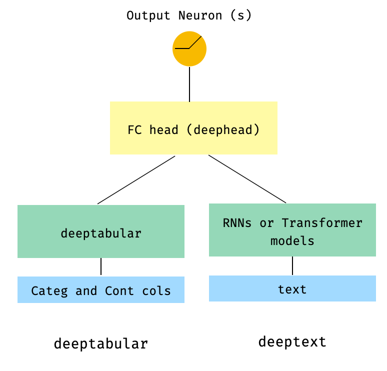
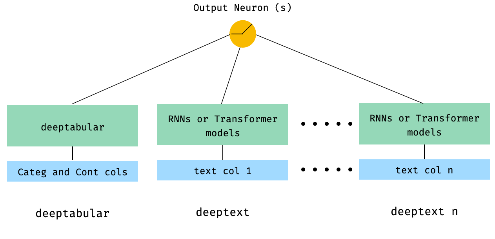
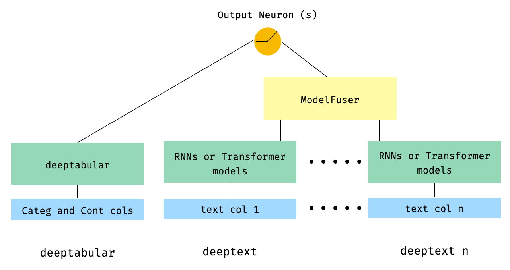
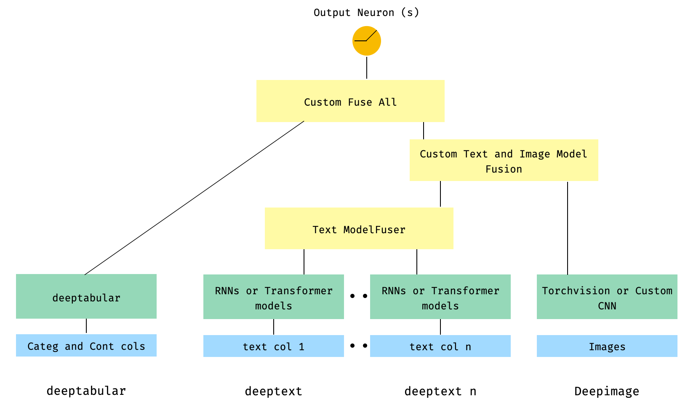
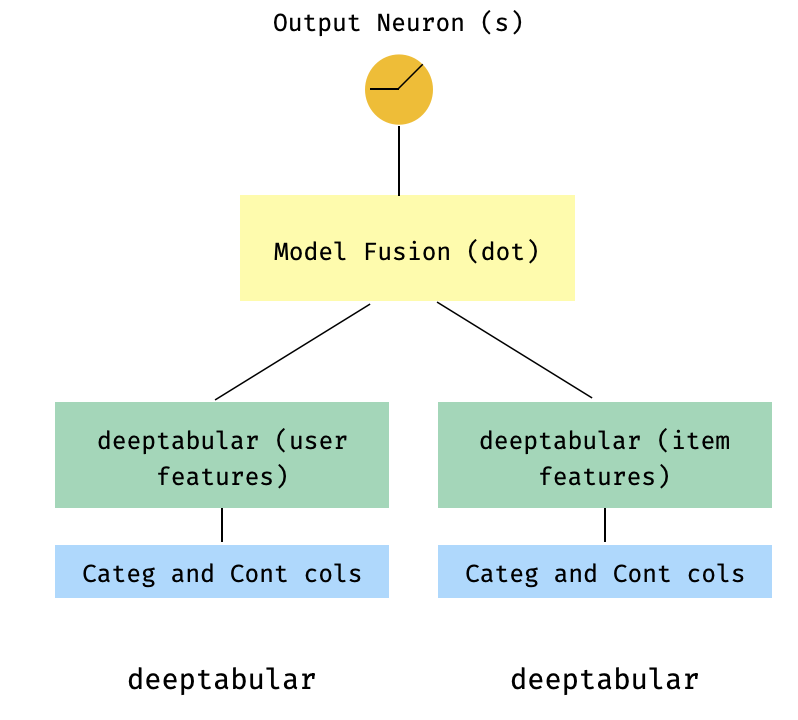

<p align="center">
  
</p>

[](https://pypi.org/project/pytorch-widedeep/)
[](https://pypi.org/project/pytorch-widedeep/)
[](https://github.com/jrzaurin/pytorch-widedeep/actions)
[](https://pytorch-widedeep.readthedocs.io/en/latest/?badge=latest)
[](https://codecov.io/gh/jrzaurin/pytorch-widedeep)
[](https://github.com/psf/black)
[](https://github.com/jrzaurin/pytorch-widedeep/graphs/commit-activity)
[](https://github.com/jrzaurin/pytorch-widedeep/issues)
[](https://join.slack.com/t/pytorch-widedeep/shared_invite/zt-soss7stf-iXpVuLeKZz8lGTnxxtHtTw)
[](https://doi.org/10.21105/joss.05027)

# pytorch-widedeep

A flexible package for multimodal-deep-learning to combine tabular data with
text and images using Wide and Deep models in Pytorch

**Documentation:** [https://pytorch-widedeep.readthedocs.io](https://pytorch-widedeep.readthedocs.io/en/latest/index.html)

**Companion posts and tutorials:** [infinitoml](https://jrzaurin.github.io/infinitoml/)

**Experiments and comparison with `LightGBM`**: [TabularDL vs LightGBM](https://github.com/jrzaurin/tabulardl-benchmark)

**Slack**: if you want to contribute or just want to chat with us, join [slack](https://join.slack.com/t/pytorch-widedeep/shared_invite/zt-soss7stf-iXpVuLeKZz8lGTnxxtHtTw)

The content of this document is organized as follows:

- [pytorch-widedeep](#pytorch-widedeep)
    - [Introduction](#introduction)
    - [Architectures](#architectures)
    - [The ``deeptabular`` component](#the-deeptabular-component)
    - [Text and Images](#text-and-images)
    - [Installation](#installation)
      - [Developer Install](#developer-install)
    - [Quick start](#quick-start)
    - [Testing](#testing)
    - [How to Contribute](#how-to-contribute)
    - [Acknowledgments](#acknowledgments)
    - [License](#license)
    - [Cite](#cite)
      - [BibTex](#bibtex)
      - [APA](#apa)

### Introduction

``pytorch-widedeep`` is based on Google's [Wide and Deep Algorithm](https://arxiv.org/abs/1606.07792),
adjusted for multi-modal datasets.

In general terms, `pytorch-widedeep` is a package to use deep learning with
tabular data. In particular, is intended to facilitate the combination of
text and images with corresponding tabular data using wide and deep models.
With that in mind there are a number of architectures that can be implemented
with the library. The main components of those architectures are shown in the
Figure below:


<p align="center">
  
</p>


In math terms, and following the notation in the
[paper](https://arxiv.org/abs/1606.07792), the expression for the architecture
without a ``deephead`` component can be formulated as:

<p align="center">
  
</p>


Where &sigma; is the sigmoid function, *'W'* are the weight matrices applied to the wide model and to the final
activations of the deep models, *'a'* are these final activations,
&phi;(x) are the cross product transformations of the original features *'x'*, and
, and *'b'* is the bias term.
In case you are wondering what are *"cross product transformations"*, here is
a quote taken directly from the paper: *"For binary features, a cross-product
transformation (e.g., “AND(gender=female, language=en)”) is 1 if and only if
the constituent features (“gender=female” and “language=en”) are all 1, and 0
otherwise".*

It is perfectly possible to use custom models (and not necessarily those in
the library) as long as the the custom models have an property called
``output_dim`` with the size of the last layer of activations, so that
``WideDeep`` can be constructed. Examples on how to use custom components can
be found in the Examples folder and the section below.

### Architectures

The `pytorch-widedeep` library offers a number of different architectures. In
this section we will show some of them in their simplest form (i.e. with
default param values in most cases) with their corresponding code snippets.
Note that **all** the snippets below shoud run locally. For a more detailed
explanation of the different components and their parameters, please refer to
the documentation.

For the examples below we will be using a toy dataset generated as follows:

```python
import os
import random

import numpy as np
import pandas as pd
from PIL import Image
from faker import Faker


def create_and_save_random_image(image_number, size=(32, 32)):

    if not os.path.exists("images"):
        os.makedirs("images")

    array = np.random.randint(0, 256, (size[0], size[1], 3), dtype=np.uint8)

    image = Image.fromarray(array)

    image_name = f"image_{image_number}.png"
    image.save(os.path.join("images", image_name))

    return image_name


fake = Faker()

cities = ["New York", "Los Angeles", "Chicago", "Houston"]
names = ["Alice", "Bob", "Charlie", "David", "Eva"]

data = {
    "city": [random.choice(cities) for _ in range(100)],
    "name": [random.choice(names) for _ in range(100)],
    "age": [random.uniform(18, 70) for _ in range(100)],
    "height": [random.uniform(150, 200) for _ in range(100)],
    "sentence": [fake.sentence() for _ in range(100)],
    "other_sentence": [fake.sentence() for _ in range(100)],
    "image_name": [create_and_save_random_image(i) for i in range(100)],
    "target": [random.choice([0, 1]) for _ in range(100)],
}

df = pd.DataFrame(data)
```

This will create a 100 rows dataframe and a dir in your local folder, called
`images` with 100 random images (or images with just noise).

Perhaps the simplest architecture would be just one component, `wide`,
`deeptabular`, `deeptext` or `deepimage` on their own, which is also
possible, but let's start the examples with a standard Wide and Deep
architecture. From there, how to build a model comprised only of one
component will be straightforward.

Note that the examples shown below would be almost identical using any of the
models available in the library. For example, `TabMlp` can be replaced by
`TabResnet`, `TabNet`, `TabTransformer`, etc. Similarly, `BasicRNN` can be
replaced by `AttentiveRNN`, `StackedAttentiveRNN`, or `HFModel` with
their corresponding parameters and preprocessor in the case of the Hugging
Face models.

**1. Wide and Tabular component (aka deeptabular)**


<p align="center">
  
</p>


```python
from pytorch_widedeep.preprocessing import TabPreprocessor, WidePreprocessor
from pytorch_widedeep.models import Wide, TabMlp, WideDeep
from pytorch_widedeep.training import Trainer

# Wide
wide_cols = ["city"]
crossed_cols = [("city", "name")]
wide_preprocessor = WidePreprocessor(wide_cols=wide_cols, crossed_cols=crossed_cols)
X_wide = wide_preprocessor.fit_transform(df)
wide = Wide(input_dim=np.unique(X_wide).shape[0])

# Tabular
tab_preprocessor = TabPreprocessor(
    embed_cols=["city", "name"], continuous_cols=["age", "height"]
)
X_tab = tab_preprocessor.fit_transform(df)
tab_mlp = TabMlp(
    column_idx=tab_preprocessor.column_idx,
    cat_embed_input=tab_preprocessor.cat_embed_input,
    continuous_cols=tab_preprocessor.continuous_cols,
    mlp_hidden_dims=[64, 32],
)

# WideDeep
model = WideDeep(wide=wide, deeptabular=tab_mlp)

# Train
trainer = Trainer(model, objective="binary")

trainer.fit(
    X_wide=X_wide,
    X_tab=X_tab,
    target=df["target"].values,
    n_epochs=1,
    batch_size=32,
)
```

**2. Tabular and Text data**

<p align="center">
  
</p>


```python
from pytorch_widedeep.preprocessing import TabPreprocessor, TextPreprocessor
from pytorch_widedeep.models import TabMlp, BasicRNN, WideDeep
from pytorch_widedeep.training import Trainer

# Tabular
tab_preprocessor = TabPreprocessor(
    embed_cols=["city", "name"], continuous_cols=["age", "height"]
)
X_tab = tab_preprocessor.fit_transform(df)
tab_mlp = TabMlp(
    column_idx=tab_preprocessor.column_idx,
    cat_embed_input=tab_preprocessor.cat_embed_input,
    continuous_cols=tab_preprocessor.continuous_cols,
    mlp_hidden_dims=[64, 32],
)

# Text
text_preprocessor = TextPreprocessor(
    text_col="sentence", maxlen=20, max_vocab=100, n_cpus=1
)
X_text = text_preprocessor.fit_transform(df)
rnn = BasicRNN(
    vocab_size=len(text_preprocessor.vocab.itos),
    embed_dim=16,
    hidden_dim=8,
    n_layers=1,
)

# WideDeep
model = WideDeep(deeptabular=tab_mlp, deeptext=rnn)

# Train
trainer = Trainer(model, objective="binary")

trainer.fit(
    X_tab=X_tab,
    X_text=X_text,
    target=df["target"].values,
    n_epochs=1,
    batch_size=32,
)
```

**3. Tabular and text with a FC head on top via the `head_hidden_dims` param
  in `WideDeep`**

<p align="center">
  
</p>

```python
from pytorch_widedeep.preprocessing import TabPreprocessor, TextPreprocessor
from pytorch_widedeep.models import TabMlp, BasicRNN, WideDeep
from pytorch_widedeep.training import Trainer

# Tabular
tab_preprocessor = TabPreprocessor(
    embed_cols=["city", "name"], continuous_cols=["age", "height"]
)
X_tab = tab_preprocessor.fit_transform(df)
tab_mlp = TabMlp(
    column_idx=tab_preprocessor.column_idx,
    cat_embed_input=tab_preprocessor.cat_embed_input,
    continuous_cols=tab_preprocessor.continuous_cols,
    mlp_hidden_dims=[64, 32],
)

# Text
text_preprocessor = TextPreprocessor(
    text_col="sentence", maxlen=20, max_vocab=100, n_cpus=1
)
X_text = text_preprocessor.fit_transform(df)
rnn = BasicRNN(
    vocab_size=len(text_preprocessor.vocab.itos),
    embed_dim=16,
    hidden_dim=8,
    n_layers=1,
)

# WideDeep
model = WideDeep(deeptabular=tab_mlp, deeptext=rnn, head_hidden_dims=[32, 16])

# Train
trainer = Trainer(model, objective="binary")

trainer.fit(
    X_tab=X_tab,
    X_text=X_text,
    target=df["target"].values,
    n_epochs=1,
    batch_size=32,
)
```

**4. Tabular and multiple text columns that are passed directly to
  `WideDeep`**

<p align="center">
  
</p>

```python
from pytorch_widedeep.preprocessing import TabPreprocessor, TextPreprocessor
from pytorch_widedeep.models import TabMlp, BasicRNN, WideDeep
from pytorch_widedeep.training import Trainer


# Tabular
tab_preprocessor = TabPreprocessor(
    embed_cols=["city", "name"], continuous_cols=["age", "height"]
)
X_tab = tab_preprocessor.fit_transform(df)
tab_mlp = TabMlp(
    column_idx=tab_preprocessor.column_idx,
    cat_embed_input=tab_preprocessor.cat_embed_input,
    continuous_cols=tab_preprocessor.continuous_cols,
    mlp_hidden_dims=[64, 32],
)

# Text
text_preprocessor_1 = TextPreprocessor(
    text_col="sentence", maxlen=20, max_vocab=100, n_cpus=1
)
X_text_1 = text_preprocessor_1.fit_transform(df)
text_preprocessor_2 = TextPreprocessor(
    text_col="other_sentence", maxlen=20, max_vocab=100, n_cpus=1
)
X_text_2 = text_preprocessor_2.fit_transform(df)
rnn_1 = BasicRNN(
    vocab_size=len(text_preprocessor_1.vocab.itos),
    embed_dim=16,
    hidden_dim=8,
    n_layers=1,
)
rnn_2 = BasicRNN(
    vocab_size=len(text_preprocessor_2.vocab.itos),
    embed_dim=16,
    hidden_dim=8,
    n_layers=1,
)

# WideDeep
model = WideDeep(deeptabular=tab_mlp, deeptext=[rnn_1, rnn_2])

# Train
trainer = Trainer(model, objective="binary")

trainer.fit(
    X_tab=X_tab,
    X_text=[X_text_1, X_text_2],
    target=df["target"].values,
    n_epochs=1,
    batch_size=32,
)
```

**5. Tabular data and multiple text columns that are fused via a the library's
  `ModelFuser` class**

<p align="center">
    
</p>

```python
from pytorch_widedeep.preprocessing import TabPreprocessor, TextPreprocessor
from pytorch_widedeep.models import TabMlp, BasicRNN, WideDeep, ModelFuser
from pytorch_widedeep import Trainer

# Tabular
tab_preprocessor = TabPreprocessor(
    embed_cols=["city", "name"], continuous_cols=["age", "height"]
)
X_tab = tab_preprocessor.fit_transform(df)
tab_mlp = TabMlp(
    column_idx=tab_preprocessor.column_idx,
    cat_embed_input=tab_preprocessor.cat_embed_input,
    continuous_cols=tab_preprocessor.continuous_cols,
    mlp_hidden_dims=[64, 32],
)

# Text
text_preprocessor_1 = TextPreprocessor(
    text_col="sentence", maxlen=20, max_vocab=100, n_cpus=1
)
X_text_1 = text_preprocessor_1.fit_transform(df)
text_preprocessor_2 = TextPreprocessor(
    text_col="other_sentence", maxlen=20, max_vocab=100, n_cpus=1
)
X_text_2 = text_preprocessor_2.fit_transform(df)

rnn_1 = BasicRNN(
    vocab_size=len(text_preprocessor_1.vocab.itos),
    embed_dim=16,
    hidden_dim=8,
    n_layers=1,
)
rnn_2 = BasicRNN(
    vocab_size=len(text_preprocessor_2.vocab.itos),
    embed_dim=16,
    hidden_dim=8,
    n_layers=1,
)

models_fuser = ModelFuser(models=[rnn_1, rnn_2], fusion_method="mult")

# WideDeep
model = WideDeep(deeptabular=tab_mlp, deeptext=models_fuser)

# Train
trainer = Trainer(model, objective="binary")

trainer.fit(
    X_tab=X_tab,
    X_text=[X_text_1, X_text_2],
    target=df["target"].values,
    n_epochs=1,
    batch_size=32,
)
```

**6. Tabular and multiple text columns, with an image column. The text columns
  are fused via the library's `ModelFuser` and then all fused via the
  deephead paramenter in `WideDeep` which is a custom `ModelFuser` coded by
  the user**

This is perhaps the less elegant solution as it involves a custom component by
the user and slicing the 'incoming' tensor. In the future, we will include a
`TextAndImageModelFuser` to make this process more straightforward. Still, is not
really complicated and it is a good example of how to use custom components in
`pytorch-widedeep`.

Note that the only requirement for the custom component is that it has a
property called `output_dim` that returns the size of the last layer of
activations. In other words, it does not need to inherit from
`BaseWDModelComponent`. This base class simply checks the existence of such
property and avoids some typing errors internally.


<p align="center">
    
</p>


```python
import torch

from pytorch_widedeep.preprocessing import TabPreprocessor, TextPreprocessor, ImagePreprocessor
from pytorch_widedeep.models import TabMlp, BasicRNN, WideDeep, ModelFuser, Vision
from pytorch_widedeep.models._base_wd_model_component import BaseWDModelComponent
from pytorch_widedeep import Trainer

# Tabular
tab_preprocessor = TabPreprocessor(
    embed_cols=["city", "name"], continuous_cols=["age", "height"]
)
X_tab = tab_preprocessor.fit_transform(df)
tab_mlp = TabMlp(
    column_idx=tab_preprocessor.column_idx,
    cat_embed_input=tab_preprocessor.cat_embed_input,
    continuous_cols=tab_preprocessor.continuous_cols,
    mlp_hidden_dims=[16, 8],
)

# Text
text_preprocessor_1 = TextPreprocessor(
    text_col="sentence", maxlen=20, max_vocab=100, n_cpus=1
)
X_text_1 = text_preprocessor_1.fit_transform(df)
text_preprocessor_2 = TextPreprocessor(
    text_col="other_sentence", maxlen=20, max_vocab=100, n_cpus=1
)
X_text_2 = text_preprocessor_2.fit_transform(df)
rnn_1 = BasicRNN(
    vocab_size=len(text_preprocessor_1.vocab.itos),
    embed_dim=16,
    hidden_dim=8,
    n_layers=1,
)
rnn_2 = BasicRNN(
    vocab_size=len(text_preprocessor_2.vocab.itos),
    embed_dim=16,
    hidden_dim=8,
    n_layers=1,
)
models_fuser = ModelFuser(
    models=[rnn_1, rnn_2],
    fusion_method="mult",
)

# Image
image_preprocessor = ImagePreprocessor(img_col="image_name", img_path="images")
X_img = image_preprocessor.fit_transform(df)
vision = Vision(pretrained_model_setup="resnet18", head_hidden_dims=[16, 8])

# deephead (custom model fuser)
class MyModelFuser(BaseWDModelComponent):
    """
    Simply a Linear + Relu sequence on top of the text + images followed by a
    Linear -> Relu -> Linear for the concatenation of tabular slice of the
    tensor and the output of the text and image sequential model
    """
    def __init__(
        self,
        tab_incoming_dim: int,
        text_incoming_dim: int,
        image_incoming_dim: int,
        output_units: int,
    ):

        super(MyModelFuser, self).__init__()

        self.tab_incoming_dim = tab_incoming_dim
        self.text_incoming_dim = text_incoming_dim
        self.image_incoming_dim = image_incoming_dim
        self.output_units = output_units
        self.text_and_image_fuser = torch.nn.Sequential(
            torch.nn.Linear(text_incoming_dim + image_incoming_dim, output_units),
            torch.nn.ReLU(),
        )
        self.out = torch.nn.Sequential(
            torch.nn.Linear(output_units + tab_incoming_dim, output_units * 4),
            torch.nn.ReLU(),
            torch.nn.Linear(output_units * 4, output_units),
        )

    def forward(self, X: torch.Tensor) -> torch.Tensor:
        tab_slice = slice(0, self.tab_incoming_dim)
        text_slice = slice(
            self.tab_incoming_dim, self.tab_incoming_dim + self.text_incoming_dim
        )
        image_slice = slice(
            self.tab_incoming_dim + self.text_incoming_dim,
            self.tab_incoming_dim + self.text_incoming_dim + self.image_incoming_dim,
        )
        X_tab = X[:, tab_slice]
        X_text = X[:, text_slice]
        X_img = X[:, image_slice]
        X_text_and_image = self.text_and_image_fuser(torch.cat([X_text, X_img], dim=1))
        return self.out(torch.cat([X_tab, X_text_and_image], dim=1))

    @property
    def output_dim(self):
        return self.output_units


deephead = MyModelFuser(
    tab_incoming_dim=tab_mlp.output_dim,
    text_incoming_dim=models_fuser.output_dim,
    image_incoming_dim=vision.output_dim,
    output_units=8,
)

# WideDeep
model = WideDeep(
    deeptabular=tab_mlp,
    deeptext=models_fuser,
    deepimage=vision,
    deephead=deephead,
)

# Train
trainer = Trainer(model, objective="binary")

trainer.fit(
    X_tab=X_tab,
    X_text=[X_text_1, X_text_2],
    X_img=X_img,
    target=df["target"].values,
    n_epochs=1,
    batch_size=32,
)
```

**7. Tabular with a multi-target loss**

This one is "a bonus" to illustrate the use of multi-target losses, more than
actually a different architecture.

<p align="center">
  
</p>


```python
from pytorch_widedeep.preprocessing import TabPreprocessor, TextPreprocessor, ImagePreprocessor
from pytorch_widedeep.models import TabMlp, BasicRNN, WideDeep, ModelFuser, Vision
from pytorch_widedeep.losses_multitarget import MultiTargetClassificationLoss
from pytorch_widedeep.models._base_wd_model_component import BaseWDModelComponent
from pytorch_widedeep import Trainer

# let's add a second target to the dataframe
df["target2"] = [random.choice([0, 1]) for _ in range(100)]

# Tabular
tab_preprocessor = TabPreprocessor(
    embed_cols=["city", "name"], continuous_cols=["age", "height"]
)
X_tab = tab_preprocessor.fit_transform(df)
tab_mlp = TabMlp(
    column_idx=tab_preprocessor.column_idx,
    cat_embed_input=tab_preprocessor.cat_embed_input,
    continuous_cols=tab_preprocessor.continuous_cols,
    mlp_hidden_dims=[64, 32],
)

# 'pred_dim=2' because we have two binary targets. For other types of targets,
#  please, see the documentation
model = WideDeep(deeptabular=tab_mlp, pred_dim=2).

loss = MultiTargetClassificationLoss(binary_config=[0, 1], reduction="mean")

# When a multi-target loss is used, 'custom_loss_function' must not be None.
# See the docs
trainer = Trainer(model, objective="multitarget", custom_loss_function=loss)

trainer.fit(
    X_tab=X_tab,
    target=df[["target", "target2"]].values,
    n_epochs=1,
    batch_size=32,
)
```

### The ``deeptabular`` component

It is important to emphasize again that **each individual component, `wide`,
`deeptabular`, `deeptext` and `deepimage`, can be used independently** and in
isolation. For example, one could use only `wide`, which is in simply a
linear model. In fact, one of the most interesting functionalities
in``pytorch-widedeep`` would be the use of the ``deeptabular`` component on
its own, i.e. what one might normally refer as Deep Learning for Tabular
Data. Currently, ``pytorch-widedeep`` offers the following different models
for that component:

0. **Wide**: a simple linear model where the nonlinearities are captured via
cross-product transformations, as explained before.
1. **TabMlp**: a simple MLP that receives embeddings representing the
categorical features, concatenated with the continuous features, which can
also be embedded.
2. **TabResnet**: similar to the previous model but the embeddings are
passed through a series of ResNet blocks built with dense layers.
3. **TabNet**: details on TabNet can be found in
[TabNet: Attentive Interpretable Tabular Learning](https://arxiv.org/abs/1908.07442)

Two simpler attention based models that we call:

4. **ContextAttentionMLP**: MLP with at attention mechanism "on top" that is based on
    [Hierarchical Attention Networks for Document Classification](https://www.cs.cmu.edu/~./hovy/papers/16HLT-hierarchical-attention-networks.pd)
5. **SelfAttentionMLP**: MLP with an attention mechanism that is a simplified
    version of a transformer block that we refer as "query-key self-attention".

The ``Tabformer`` family, i.e. Transformers for Tabular data:

6. **TabTransformer**: details on the TabTransformer can be found in
[TabTransformer: Tabular Data Modeling Using Contextual Embeddings](https://arxiv.org/pdf/2012.06678.pdf).
7. **SAINT**: Details on SAINT can be found in
[SAINT: Improved Neural Networks for Tabular Data via Row Attention and Contrastive Pre-Training](https://arxiv.org/abs/2106.01342).
8. **FT-Transformer**: details on the FT-Transformer can be found in
[Revisiting Deep Learning Models for Tabular Data](https://arxiv.org/abs/2106.11959).
9. **TabFastFormer**: adaptation of the FastFormer for tabular data. Details
on the Fasformer can be found in
[FastFormers: Highly Efficient Transformer Models for Natural Language Understanding](https://arxiv.org/abs/2010.13382)
10. **TabPerceiver**: adaptation of the Perceiver for tabular data. Details on
the Perceiver can be found in
[Perceiver: General Perception with Iterative Attention](https://arxiv.org/abs/2103.03206)

And probabilistic DL models for tabular data based on
[Weight Uncertainty in Neural Networks](https://arxiv.org/abs/1505.05424):

11. **BayesianWide**: Probabilistic adaptation of the `Wide` model.
12. **BayesianTabMlp**: Probabilistic adaptation of the `TabMlp` model

Note that while there are scientific publications for the TabTransformer,
SAINT and FT-Transformer, the TabFasfFormer and TabPerceiver are our own
adaptation of those algorithms for tabular data.

In addition, Self-Supervised pre-training can be used for all `deeptabular`
models, with the exception of the `TabPerceiver`. Self-Supervised
pre-training can be used via two methods or routines which we refer as:
encoder-decoder method and constrastive-denoising method. Please, see the
documentation and the examples for details on this functionality, and all
other options in the library.

### Text and Images
For the text component, `deeptext`, the library offers the following models:

1. **BasicRNN**: a simple RNN 2. **AttentiveRNN**: a RNN with an attention
mechanism based on the
[Hierarchical Attention Networks for DocumentClassification](https://www.cs.cmu.edu/~./hovy/papers/16HLT-hierarchical-attention-networks.pd)
3. **StackedAttentiveRNN**: a stack of AttentiveRNNs
4. **HFModel**: a wrapper around Hugging Face Transfomer-based models. At the moment
only models from the families BERT, RoBERTa, DistilBERT, ALBERT and ELECTRA
are supported. This is because this library is designed to address
classification and regression tasks and these are the most 'popular'
encoder-only models, which have proved to be those that work best for these
tasks. If there is demand for other models, they will be included in the
future.

For the image component, `deepimage`, the library supports models from the
following families:
'resnet', 'shufflenet', 'resnext', 'wide_resnet', 'regnet', 'densenet', 'mobilenetv3',
 'mobilenetv2', 'mnasnet', 'efficientnet' and 'squeezenet'.  These are
 offered via `torchvision` and wrapped up in the `Vision` class.

###  Installation

Install using pip:

```bash
pip install pytorch-widedeep
```

Or install directly from github

```bash
pip install git+https://github.com/jrzaurin/pytorch-widedeep.git
```

#### Developer Install

```bash
# Clone the repository
git clone https://github.com/jrzaurin/pytorch-widedeep
cd pytorch-widedeep

# Install in dev mode
pip install -e .
```

### Quick start

Here is an end-to-end example of a binary classification with the [adult
dataset]([adult](https://www.kaggle.com/wenruliu/adult-income-dataset))
using `Wide` and `DeepDense` and defaults settings.

Building a wide (linear) and deep model with ``pytorch-widedeep``:

```python
import numpy as np
import torch
from sklearn.model_selection import train_test_split

from pytorch_widedeep import Trainer
from pytorch_widedeep.preprocessing import WidePreprocessor, TabPreprocessor
from pytorch_widedeep.models import Wide, TabMlp, WideDeep
from pytorch_widedeep.metrics import Accuracy
from pytorch_widedeep.datasets import load_adult


df = load_adult(as_frame=True)
df["income_label"] = (df["income"].apply(lambda x: ">50K" in x)).astype(int)
df.drop("income", axis=1, inplace=True)
df_train, df_test = train_test_split(df, test_size=0.2, stratify=df.income_label)

# Define the 'column set up'
wide_cols = [
    "education",
    "relationship",
    "workclass",
    "occupation",
    "native-country",
    "gender",
]
crossed_cols = [("education", "occupation"), ("native-country", "occupation")]

cat_embed_cols = [
    "workclass",
    "education",
    "marital-status",
    "occupation",
    "relationship",
    "race",
    "gender",
    "capital-gain",
    "capital-loss",
    "native-country",
]
continuous_cols = ["age", "hours-per-week"]
target = "income_label"
target = df_train[target].values

# prepare the data
wide_preprocessor = WidePreprocessor(wide_cols=wide_cols, crossed_cols=crossed_cols)
X_wide = wide_preprocessor.fit_transform(df_train)

tab_preprocessor = TabPreprocessor(
    cat_embed_cols=cat_embed_cols, continuous_cols=continuous_cols  # type: ignore[arg-type]
)
X_tab = tab_preprocessor.fit_transform(df_train)

# build the model
wide = Wide(input_dim=np.unique(X_wide).shape[0], pred_dim=1)
tab_mlp = TabMlp(
    column_idx=tab_preprocessor.column_idx,
    cat_embed_input=tab_preprocessor.cat_embed_input,
    continuous_cols=continuous_cols,
)
model = WideDeep(wide=wide, deeptabular=tab_mlp)

# train and validate
trainer = Trainer(model, objective="binary", metrics=[Accuracy])
trainer.fit(
    X_wide=X_wide,
    X_tab=X_tab,
    target=target,
    n_epochs=5,
    batch_size=256,
)

# predict on test
X_wide_te = wide_preprocessor.transform(df_test)
X_tab_te = tab_preprocessor.transform(df_test)
preds = trainer.predict(X_wide=X_wide_te, X_tab=X_tab_te)

# Save and load

# Option 1: this will also save training history and lr history if the
# LRHistory callback is used
trainer.save(path="model_weights", save_state_dict=True)

# Option 2: save as any other torch model
torch.save(model.state_dict(), "model_weights/wd_model.pt")

# From here in advance, Option 1 or 2 are the same. I assume the user has
# prepared the data and defined the new model components:
# 1. Build the model
model_new = WideDeep(wide=wide, deeptabular=tab_mlp)
model_new.load_state_dict(torch.load("model_weights/wd_model.pt"))

# 2. Instantiate the trainer
trainer_new = Trainer(model_new, objective="binary")

# 3. Either start the fit or directly predict
preds = trainer_new.predict(X_wide=X_wide, X_tab=X_tab, batch_size=32)
```

Of course, one can do **much more**. See the Examples folder, the
documentation or the companion posts for a better understanding of the content
of the package and its functionalities.

### Testing

```
pytest tests
```

### How to Contribute

Check [CONTRIBUTING](https://github.com/jrzaurin/pytorch-widedeep/blob/master/CONTRIBUTING.MD) page.

### Acknowledgments

This library takes from a series of other libraries, so I think it is just
fair to mention them here in the README (specific mentions are also included
in the code).

The `Callbacks` and `Initializers` structure and code is inspired by the
[`torchsample`](https://github.com/ncullen93/torchsample) library, which in
itself partially inspired by [`Keras`](https://keras.io/).

The `TextProcessor` class in this library uses the
[`fastai`](https://docs.fast.ai/text.transform.html#BaseTokenizer.tokenizer)'s
`Tokenizer` and `Vocab`. The code at `utils.fastai_transforms` is a minor
adaptation of their code so it functions within this library. To my experience
their `Tokenizer` is the best in class.

The `ImageProcessor` class in this library uses code from the fantastic [Deep
Learning for Computer
Vision](https://www.pyimagesearch.com/deep-learning-computer-vision-python-book/)
(DL4CV) book by Adrian Rosebrock.

### License

This work is dual-licensed under Apache 2.0 and MIT (or any later version).
You can choose between one of them if you use this work.

`SPDX-License-Identifier: Apache-2.0 AND MIT`

### Cite

#### BibTex

```
@article{Zaurin_pytorch-widedeep_A_flexible_2023,
author = {Zaurin, Javier Rodriguez and Mulinka, Pavol},
doi = {10.21105/joss.05027},
journal = {Journal of Open Source Software},
month = jun,
number = {86},
pages = {5027},
title = {{pytorch-widedeep: A flexible package for multimodal deep learning}},
url = {https://joss.theoj.org/papers/10.21105/joss.05027},
volume = {8},
year = {2023}
}
```

#### APA

```
Zaurin, J. R., & Mulinka, P. (2023). pytorch-widedeep: A flexible package for
multimodal deep learning. Journal of Open Source Software, 8(86), 5027.
https://doi.org/10.21105/joss.05027
```
