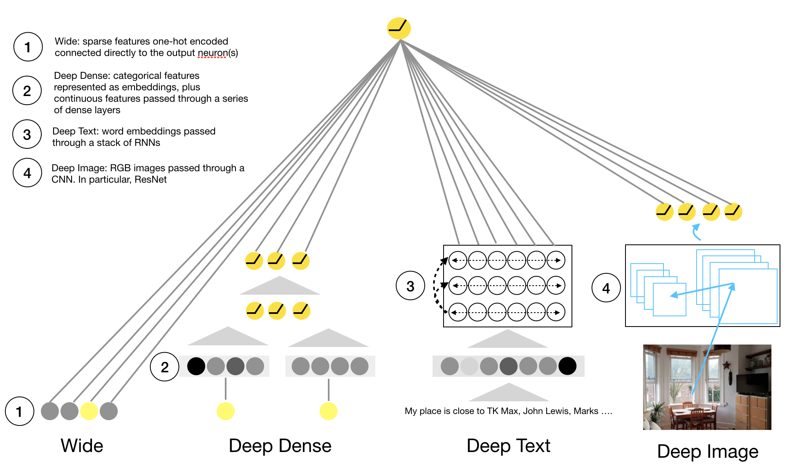

# Wide-and-Deep-PyTorch
PyTorch implementation of Tensorflow's Wide and Deep Algorithm

This is a PyTorch implementation of Tensorflow's Wide and Deep Algorithm, with
a few adds on so the algorithm can take text and images. Details of the
original algorithm can be found
[here](https://www.tensorflow.org/tutorials/wide_and_deep) and the very nice
research paper can be found [here](https://arxiv.org/abs/1606.07792). A
`Keras` (quick and relatively dirty) implementation of the algorithm can be
found [here](https://github.com/jrzaurin/Wide-and-Deep-Keras).

The Figure below is my attempt to illustrate the different components of the algorithm



## Requirements:

The algorithm was built using `python 3.6.5` and the required packages and
version I have used are:

```
pandas==0.24.2
numpy==1.16.2
scipy==1.2.1
sklearn==0.20.3
gensim==3.5.0
cv2==3.4.2
imutils==0.5.2
pytorch==1.1.0
fastai==1.0.52
tqdm==4.31.1
```

## Datasets.

I have used two datasets, the well known
[adult](https://www.kaggle.com/wenruliu/adult-income-dataset/downloads/adult.csv/2)
dataset and the latest
[airbnb](http://data.insideairbnb.com/united-kingdom/england/london/2019-03-07/data/listings.csv.gz)
listings dataset.

My working directory structure looks like this (`tree -d`):

```
.
├── data
│   ├── adult
│   │   └── wide_deep_data
│   ├── airbnb
│   │   ├── host_picture
│   │   ├── property_picture
│   │   └── wide_deep_data
│   ├── fasttext.cc
│   └── glove.6B
│   └── models
└── widedeep
    ├── models
    └── utils
```

Once you have downloaded the two files (`adult.csv` and `listings.csv`) place
them in their corresponding directories (`data/adult/` and `data/airbnb`).
Note that we also have the directories corresponding to the
[Glove](http://nlp.stanford.edu/data/glove.6B.zip) and
[FastText](https://fasttext.cc/docs/en/english-vectors.html) wordvectors. This
is because we will be dealing with text and these will be used to build the
pretrained embeddings matrix.


The Airbnb listings dataset requires a bit of preprocessing. This is attained
by simply running `python airbnb_data_preprocessing.py`. Details of what
happens within that script can be found in the companion notebook
`airbnb_data_preprocessing.ipynb`. The resulting file `listings_processed.csv`
is also stored in `data/adult/`. Then you can run `python download_images.py`
and it will download images of the hosts and their properties (Warning: this
will take a while).

Once you have:

1. Download adult and airbnb listings dataset
2. run `python airbnb_data_preprocessing.py`
3. run `python download_images.py`

your data directory will look like (`tree data -L 2`):

```
data
├── adult
│   └── adult.csv
├── airbnb
│   ├── host_picture
│   ├── listings.csv
│   ├── listings_processed.csv
│   ├── property_picture
│   └── wide_deep_data
└── models
```

And now we can move on to using the model


## How to use it.

I have included 3 demos to explain how the data needs to be prepared, how the
algorithm is built (the wide and deep parts separately). In our case the deep
part is comprised by what I call: Deep Dense, Deep Text and Deep Image. If you
are familiar with the algorithm and you just want to give it a go, you can
directly go to demo3 or have a look to main.py (which can be run as `python
main.py` and has a few more details. Also note that the parameters there are
not necessarily optimized for the best result, simply are the last set of
parameters I used). Using it is as simple as this:

### 1. Prepare the (airbnb) data

You could simply run:

```
python prepare_data.py --dataset airbnb --wordvectors fasttext --imtype property
```

and this will store a pickle `wd_dataset.p` object at `data/airbnb/wide_deep_data/`. Alternatively, you can do it manually as:


```
import numpy as np
import pandas as pd
from pathlib import Path

# I assume you have runned airbnb_data_preprocessing.py and the resulting file is at
# `data/airbnb/listings_processed.csv`
DATA_PATH=Path('data')
DF_airbnb = pd.read_csv(DATA_PATH/'airbnb/listings_processed.csv')
DF_airbnb = DF_airbnb[DF_airbnb.description.apply(lambda x: len(x.split(' '))>=10)]
out_dir = DATA_PATH/'airbnb/wide_deep_data/'

# WIDE
crossed_cols = (['property_type', 'room_type'],)
already_dummies = [c for c in DF_airbnb.columns if 'amenity' in c] + ['has_house_rules']
wide_cols = ['is_location_exact', 'property_type', 'room_type', 'host_gender'] +\
    already_dummies

# DEEP_DENSE
embeddings_cols = [(c, 16) for c in DF_airbnb.columns if 'catg' in c] + [('neighbourhood_cleansed', 64)]
continuous_cols = ['latitude', 'longitude', 'security_deposit', 'extra_people']
standardize_cols = ['security_deposit', 'extra_people']

# DEEP_TEXT
text_col = 'description'
word_vectors_path = 'data/glove.6B/glove.6B.300d.txt'

# DEEP_IMAGE
img_id = 'id'
img_path = DATA_PATH/'airbnb/property_picture'

#TARGET
target = 'yield'

# PREPARE DATA
from prepare_data import prepare_data_airbnb
wd_dataset_airbnb = prepare_data_airbnb(
    df = DF_airbnb,
    img_id = img_id,
    img_path = img_path,
    text_col = text_col,
    max_vocab = 20000,
    min_freq = 2,
    maxlen = 170,
    word_vectors_path = word_vectors_path,
    embeddings_cols = embeddings_cols,
    continuous_cols = continuous_cols,
    standardize_cols = standardize_cols,
    target = target,
    wide_cols = wide_cols,
    crossed_cols = crossed_cols,
    already_dummies = already_dummies,
    out_dir = out_dir,
    scale=True,
    seed=1
    )

```

### 2. Build the model
The model is built with the `WideDeep` class.

```
# Network set up
params = dict()
params['wide'] = dict(
    wide_dim = wd_dataset_airbnb['train']['wide'].shape[1]
    )
params['deep_dense'] = dict(
    embeddings_input = wd_dataset_airbnb['cat_embeddings_input'],
    embeddings_encoding_dict = wd_dataset_airbnb['cat_embeddings_encoding_dict'],
    continuous_cols = wd_dataset_airbnb['continuous_cols'],
    deep_column_idx = wd_dataset_airbnb['deep_column_idx'],
    hidden_layers = [64,32],
    dropout = [0.5]
    )
params['deep_text'] = dict(
    vocab_size = len(wd_dataset_airbnb['vocab'].itos),
    embedding_dim = wd_dataset_airbnb['word_embeddings_matrix'].shape[1],
    hidden_dim = 64,
    n_layers = 3,
    rnn_dropout = 0.5,
    spatial_dropout = 0.1,
    padding_idx = 1,
    attention = False,
    bidirectional = False,
    embedding_matrix = wd_dataset_airbnb['word_embeddings_matrix']
    )
params['deep_img'] = dict(
    pretrained = True,
    freeze=6,
    )

# Build the model
from widedeep.models.wide_deep import WideDeepLoader, WideDeep
model = WideDeep(output_dim=1, **params)

# Compile and run with, for example, the following set up
optimizer=dict(
    wide=['Adam', 0.1],
    deep_dense=['Adam', 0.01],
    deep_text=['RMSprop', 0.01,0.1],
    deep_img= ['Adam', 0.01]
    )
lr_scheduler=dict(
    wide=['StepLR', 3, 0.1],
    deep_dense=['StepLR', 3, 0.1],
    deep_text=['MultiStepLR', [3,5,7], 0.1],
    deep_img=['MultiStepLR', [3,5,7], 0.1]
    )
model.compile(method='regression', optimizer=optimizer, lr_scheduler=lr_scheduler)
if use_cuda:
    model = model.cuda()
```

### 3. Fit and predict

```
# Define the data loaders
mean=[0.485, 0.456, 0.406] #RGB
std=[0.229, 0.224, 0.225]  #RGB
transform  = transforms.Compose([
    transforms.ToTensor(),
    transforms.Normalize(mean=mean, std=std)
])
train_set = WideDeepLoader(wd_dataset_airbnb['train'], transform, mode='train')
valid_set = WideDeepLoader(wd_dataset_airbnb['valid'], transform, mode='train')
test_set = WideDeepLoader(wd_dataset_airbnb['test'], transform, mode='test')
train_loader = torch.utils.data.DataLoader(dataset=train_set,
    batch_size=128,shuffle=True)
valid_loader = torch.utils.data.DataLoader(dataset=valid_set,
    batch_size=128,shuffle=True)
test_loader = torch.utils.data.DataLoader(dataset=test_set,
    batch_size=32,shuffle=False)

# Fit
model.fit(n_epochs=5, train_loader=train_loader, eval_loader=valid_loader)

# Predict
preds = model.predict(test_loader)

# save
torch.save(model.state_dict(), 'model/logistic.pkl')
```

And that's it. I have also included two python files:
`lightgbm_adult_benchmark.py` and `lightgbm_airbnb_benchmark.py`. If you run
it you will see that `lightgbm` produces significantly better results than
Wide and Deep (although I have not put much effort in optimizing the
parameters for Wide and Deep). With this I simply wanted to illustrate that
in many occasions a simpler solution is faster and better. However, there will
be a number of problems where wide and deep algorithms will come very handy
(i.e. feature representation learning).


