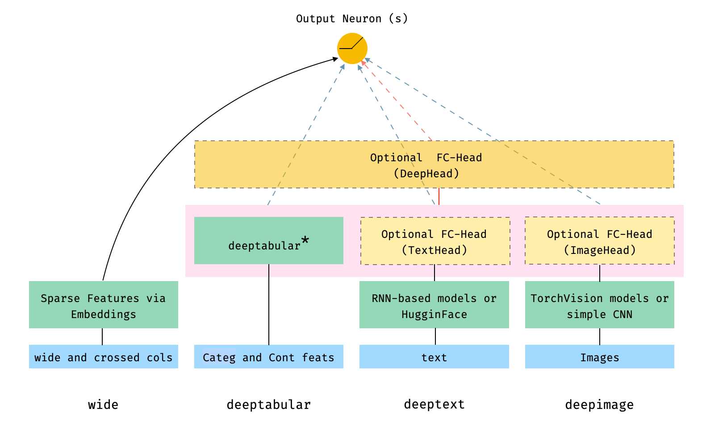
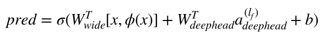

<p align="center">
  
</p>

[](https://pypi.org/project/pytorch-widedeep/)
[](https://pypi.org/project/pytorch-widedeep/)
[](https://github.com/jrzaurin/pytorch-widedeep/actions)
[](https://pytorch-widedeep.readthedocs.io/en/latest/?badge=latest)
[](https://codecov.io/gh/jrzaurin/pytorch-widedeep)
[](https://github.com/psf/black)
[](https://github.com/jrzaurin/pytorch-widedeep/graphs/commit-activity)
[](https://github.com/jrzaurin/pytorch-widedeep/issues)
[](https://join.slack.com/t/pytorch-widedeep/shared_invite/zt-soss7stf-iXpVuLeKZz8lGTnxxtHtTw)

# pytorch-widedeep

A flexible package for multimodal-deep-learning to combine tabular data with
text and images using Wide and Deep models in Pytorch

**Documentation:** [https://pytorch-widedeep.readthedocs.io](https://pytorch-widedeep.readthedocs.io/en/latest/index.html)

**Companion posts and tutorials:** [infinitoml](https://jrzaurin.github.io/infinitoml/)

**Experiments and comparison with `LightGBM`**: [TabularDL vs LightGBM](https://github.com/jrzaurin/tabulardl-benchmark)

The content of this document is organized as follows:

1. [introduction](#introduction)
2. [The deeptabular component](#the-deeptabular-component)
3. [installation](#installation)
4. [quick start (tl;dr)](#quick-start)

### Introduction

``pytorch-widedeep`` is based on Google's [Wide and Deep Algorithm](https://arxiv.org/abs/1606.07792),
adjusted for multi-modal datasets

In general terms, `pytorch-widedeep` is a package to use deep learning with
tabular data. In particular, is intended to facilitate the combination of text
and images with corresponding tabular data using wide and deep models. With
that in mind there are a number of architectures that can be implemented with
just a few lines of code. The main components of those architectures are shown
in the Figure below:


<p align="center">
  
</p>

The dashed boxes in the figure represent optional, overall components, and the
dashed lines/arrows indicate the corresponding connections, depending on
whether or not certain components are present. For example, the dashed,
blue-lines indicate that the ``deeptabular``, ``deeptext`` and ``deepimage``
components are connected directly to the output neuron or neurons (depending
on whether we are performing a binary classification or regression, or a
multi-class classification) if the optional ``deephead`` is not present.
Finally, the components within the faded-pink rectangle are concatenated.

Note that it is not possible to illustrate the number of possible
architectures and components available in ``pytorch-widedeep`` in one Figure.
Therefore, for more details on possible architectures (and more) please, see
the
[documentation]((https://pytorch-widedeep.readthedocs.io/en/latest/index.html)),
or the Examples folders and the notebooks there.

In math terms, and following the notation in the
[paper](https://arxiv.org/abs/1606.07792), the expression for the architecture
without a ``deephead`` component can be formulated as:

<p align="center">
  
</p>


Where *'W'* are the weight matrices applied to the wide model and to the final
activations of the deep models, *'a'* are these final activations, and
&phi;(x) are the cross product transformations of the original features *'x'*.
In case you are wondering what are *"cross product transformations"*, here is
a quote taken directly from the paper: *"For binary features, a cross-product
transformation (e.g., “AND(gender=female, language=en)”) is 1 if and only if
the constituent features (“gender=female” and “language=en”) are all 1, and 0
otherwise".*


While if there is a ``deephead`` component, the previous expression turns
into:

<p align="center">
  
</p>

It is perfectly possible to use custom models (and not necessarily those in
the library) as long as the the custom models have an attribute called
``output_dim`` with the size of the last layer of activations, so that
``WideDeep`` can be constructed. Examples on how to use custom components can
be found in the Examples folder.

### The ``deeptabular`` component

It is important to emphasize that **each individual component, `wide`,
`deeptabular`, `deeptext` and `deepimage`, can be used independently** and in
isolation. For example, one could use only `wide`, which is in simply a
linear model. In fact, one of the most interesting functionalities
in``pytorch-widedeep`` would be the use of the ``deeptabular`` component on
its own, i.e. what one might normally refer as Deep Learning for Tabular
Data. Currently, ``pytorch-widedeep`` offers the following different models
for that component:

0. **Wide**: a simple linear model where the nonlinearities are captured via
cross-product transformations, as explained before.
1. **TabMlp**: a simple MLP that receives embeddings representing the
categorical features, concatenated with the continuous features, which can
also be embedded.
2. **TabResnet**: similar to the previous model but the embeddings are
passed through a series of ResNet blocks built with dense layers.
3. **TabNet**: details on TabNet can be found in
[TabNet: Attentive Interpretable Tabular Learning](https://arxiv.org/abs/1908.07442)

The ``Tabformer`` family, i.e. Transformers for Tabular data:

4. **TabTransformer**: details on the TabTransformer can be found in
[TabTransformer: Tabular Data Modeling Using Contextual Embeddings](https://arxiv.org/pdf/2012.06678.pdf).
5. **SAINT**: Details on SAINT can be found in
[SAINT: Improved Neural Networks for Tabular Data via Row Attention and Contrastive Pre-Training](https://arxiv.org/abs/2106.01342).
6. **FT-Transformer**: details on the FT-Transformer can be found in
[Revisiting Deep Learning Models for Tabular Data](https://arxiv.org/abs/2106.11959).
7. **TabFastFormer**: adaptation of the FastFormer for tabular data. Details
on the Fasformer can be found in
[FastFormers: Highly Efficient Transformer Models for Natural Language Understanding](https://arxiv.org/abs/2010.13382)
8. **TabPerceiver**: adaptation of the Perceiver for tabular data. Details on
the Perceiver can be found in
[Perceiver: General Perception with Iterative Attention](https://arxiv.org/abs/2103.03206)

And probabilistic DL models for tabular data based on
[Weight Uncertainty in Neural Networks](https://arxiv.org/abs/1505.05424):

9. **BayesianWide**: Probabilistic adaptation of the `Wide` model.
10. **BayesianTabMlp**: Probabilistic adaptation of the `TabMlp` model

Note that while there are scientific publications for the TabTransformer,
SAINT and FT-Transformer, the TabFasfFormer and TabPerceiver are our own
adaptation of those algorithms for tabular data.

For details on these models (and all the other models in the library for the
different data modes) and their corresponding options please see the examples
in the Examples folder and the documentation.

###  Installation

Install using pip:

```bash
pip install pytorch-widedeep
```

Or install directly from github

```bash
pip install git+https://github.com/jrzaurin/pytorch-widedeep.git
```

#### Developer Install

```bash
# Clone the repository
git clone https://github.com/jrzaurin/pytorch-widedeep
cd pytorch-widedeep

# Install in dev mode
pip install -e .
```

### Quick start

Binary classification with the [adult
dataset]([adult](https://www.kaggle.com/wenruliu/adult-income-dataset))
using `Wide` and `DeepDense` and defaults settings.

Building a wide (linear) and deep model with ``pytorch-widedeep``:

```python
import pandas as pd
import numpy as np
import torch
from sklearn.model_selection import train_test_split

from pytorch_widedeep import Trainer
from pytorch_widedeep.preprocessing import WidePreprocessor, TabPreprocessor
from pytorch_widedeep.models import Wide, TabMlp, WideDeep
from pytorch_widedeep.metrics import Accuracy
from pytorch_widedeep.datasets import load_adult


df = load_adult(as_frame=True)
df["income_label"] = (df["income"].apply(lambda x: ">50K" in x)).astype(int)
df.drop("income", axis=1, inplace=True)
df_train, df_test = train_test_split(df, test_size=0.2, stratify=df.income_label)

# Define the 'column set up'
wide_cols = [
    "education",
    "relationship",
    "workclass",
    "occupation",
    "native-country",
    "gender",
]
crossed_cols = [("education", "occupation"), ("native-country", "occupation")]

cat_embed_cols = [
    "workclass",
    "education",
    "marital-status",
    "occupation",
    "relationship",
    "race",
    "gender",
    "capital-gain",
    "capital-loss",
    "native-country",
]
continuous_cols = ["age", "hours-per-week"]
target = "income_label"
target = df_train[target].values

# prepare the data
wide_preprocessor = WidePreprocessor(wide_cols=wide_cols, crossed_cols=crossed_cols)
X_wide = wide_preprocessor.fit_transform(df_train)

tab_preprocessor = TabPreprocessor(
    cat_embed_cols=cat_embed_cols, continuous_cols=continuous_cols  # type: ignore[arg-type]
)
X_tab = tab_preprocessor.fit_transform(df_train)

# build the model
wide = Wide(input_dim=np.unique(X_wide).shape[0], pred_dim=1)
tab_mlp = TabMlp(
    column_idx=tab_preprocessor.column_idx,
    cat_embed_input=tab_preprocessor.cat_embed_input,
    continuous_cols=continuous_cols,
)
model = WideDeep(wide=wide, deeptabular=tab_mlp)

# train and validate
trainer = Trainer(model, objective="binary", metrics=[Accuracy])
trainer.fit(
    X_wide=X_wide,
    X_tab=X_tab,
    target=target,
    n_epochs=5,
    batch_size=256,
)

# predict on test
X_wide_te = wide_preprocessor.transform(df_test)
X_tab_te = tab_preprocessor.transform(df_test)
preds = trainer.predict(X_wide=X_wide_te, X_tab=X_tab_te)

# Save and load

# Option 1: this will also save training history and lr history if the
# LRHistory callback is used
trainer.save(path="model_weights", save_state_dict=True)

# Option 2: save as any other torch model
torch.save(model.state_dict(), "model_weights/wd_model.pt")

# From here in advance, Option 1 or 2 are the same. I assume the user has
# prepared the data and defined the new model components:
# 1. Build the model
model_new = WideDeep(wide=wide, deeptabular=tab_mlp)
model_new.load_state_dict(torch.load("model_weights/wd_model.pt"))

# 2. Instantiate the trainer
trainer_new = Trainer(model_new, objective="binary")

# 3. Either start the fit or directly predict
preds = trainer_new.predict(X_wide=X_wide, X_tab=X_tab)
```

Of course, one can do **much more**. See the Examples folder, the
documentation or the companion posts for a better understanding of the content
of the package and its functionalities.

### Testing

```
pytest tests
```

### How to Contribute

Check [CONTRIBUTING](https://github.com/jrzaurin/pytorch-widedeep/CONTRIBUTING.MD) page.

### Acknowledgments

This library takes from a series of other libraries, so I think it is just
fair to mention them here in the README (specific mentions are also included
in the code).

The `Callbacks` and `Initializers` structure and code is inspired by the
[`torchsample`](https://github.com/ncullen93/torchsample) library, which in
itself partially inspired by [`Keras`](https://keras.io/).

The `TextProcessor` class in this library uses the
[`fastai`](https://docs.fast.ai/text.transform.html#BaseTokenizer.tokenizer)'s
`Tokenizer` and `Vocab`. The code at `utils.fastai_transforms` is a minor
adaptation of their code so it functions within this library. To my experience
their `Tokenizer` is the best in class.

The `ImageProcessor` class in this library uses code from the fantastic [Deep
Learning for Computer
Vision](https://www.pyimagesearch.com/deep-learning-computer-vision-python-book/)
(DL4CV) book by Adrian Rosebrock.