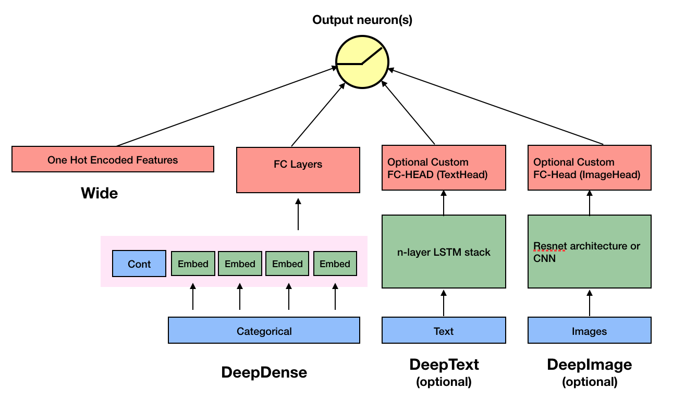
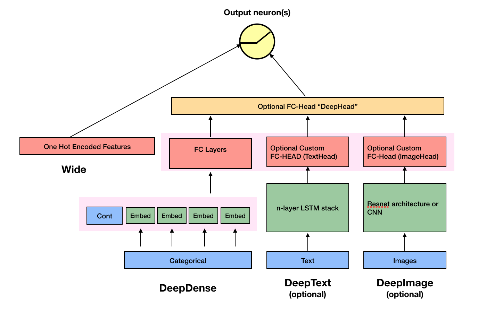

<p align="center">
  
</p>

[](https://travis-ci.org/jrzaurin/pytorch-widedeep)
[](https://pytorch-widedeep.readthedocs.io/en/latest/?badge=latest)
[](https://badge.fury.io/py/pytorch-widedeep)
[](https://github.com/jrzaurin/pytorch-widedeep/graphs/commit-activity)
[](https://github.com/jrzaurin/pytorch-widedeep/issues)
[](https://codecov.io/gh/jrzaurin/pytorch-widedeep)
[](https://www.python.org/)

# pytorch-widedeep

A flexible package to combine tabular data with text and images using wide and
deep models.

**Documentation:** [https://pytorch-widedeep.readthedocs.io](https://pytorch-widedeep.readthedocs.io/en/latest/index.html)

### Introduction

`pytorch-widedeep` is based on Google's Wide and Deep Algorithm. Details of
the original algorithm can be found
[here](https://www.tensorflow.org/tutorials/wide_and_deep), and the nice
research paper can be found [here](https://arxiv.org/abs/1606.07792).

In general terms, `pytorch-widedeep` is a package to use deep learning with
tabular data. In particular, is intended to facilitate the combination of text
and images with corresponding tabular data using wide and deep models. With
that in mind there are two architectures that can be implemented with just a
few lines of code.

### Architectures

**Architecture 1**:

<p align="center">
  
</p>

Architecture 1 combines the `Wide`, Linear model with the outputs from the
`DeepDense` or `DeepDenseResnet`, `DeepText` and `DeepImage` components
connected to a final output neuron or neurons, depending on whether we are
performing a binary classification or regression, or a multi-class
classification. The components within the faded-pink rectangles are
concatenated.

In math terms, and following the notation in the
[paper](https://arxiv.org/abs/1606.07792), Architecture 1 can be formulated
as:

<p align="center">
  
</p>


Where *'W'* are the weight matrices applied to the wide model and to the final
activations of the deep models, *'a'* are these final activations, and
&phi;(x) are the cross product transformations of the original features *'x'*.
In case you are wondering what are *"cross product transformations"*, here is
a quote taken directly from the paper: *"For binary features, a cross-product
transformation (e.g., “AND(gender=female, language=en)”) is 1 if and only if
the constituent features (“gender=female” and “language=en”) are all 1, and 0
otherwise".*


**Architecture 2**

<p align="center">
  
</p>

Architecture 2 combines the `Wide`, Linear model with the Deep components of
the model connected to the output neuron(s), after the different Deep
components have been themselves combined through a FC-Head (that I refer as
`deephead`).

In math terms, and following the notation in the
[paper](https://arxiv.org/abs/1606.07792), Architecture 2 can be formulated
as:

<p align="center">
  
</p>

Note that each individual component, `wide`, `deepdense` (either `DeepDense`
or `DeepDenseResnet`), `deeptext` and `deepimage`, can be used independently
and in isolation. For example, one could use only `wide`, which is in simply a
linear model.

On the other hand, while I recommend using the `Wide` and `DeepDense` (or
`DeepDenseResnet`) classes in `pytorch-widedeep` to build the `wide` and
`deepdense` component, it is very likely that users will want to use their own
models in the case of the `deeptext` and `deepimage` components. That is
perfectly possible as long as the the custom models have an attribute called
`output_dim` with the size of the last layer of activations, so that
`WideDeep` can be constructed

`pytorch-widedeep` includes standard text (stack of LSTMs) and image
(pre-trained ResNets or stack of CNNs) models.

See the examples folder or the docs for more information.


### Installation

Install using pip:

```bash
pip install pytorch-widedeep
```

Or install directly from github

```bash
pip install git+https://github.com/jrzaurin/pytorch-widedeep.git
```

#### Developer Install

```bash
# Clone the repository
git clone https://github.com/jrzaurin/pytorch-widedeep
cd pytorch-widedeep

# Install in dev mode
pip install -e .
```

**Important note for Mac users**: at the time of writing (Dec-2020) the latest
`torch` release is `1.7`. This release has some
[issues](https://stackoverflow.com/questions/64772335/pytorch-w-parallelnative-cpp206)
when running on Mac and the data-loaders will not run in parallel. In
addition, since `python 3.8`, [the `multiprocessing` library start method
changed from `'fork'` to
`'spawn'`](https://docs.python.org/3/library/multiprocessing.html#contexts-and-start-methods).
This also affects the data-loaders (for any `torch` version) and they will not
run in parallel. Therefore, for Mac users I recommend using `python 3.6` or
`3.7` and `torch <= 1.6` (with the corresponding, consistent version of
`torchvision`, e.g. `0.7.0` for `torch 1.6`). I do not want to force this
versioning in the `setup.py` file since I expect that all these issues are
fixed in the future. Therefore, after installing `pytorch-widedeep` via pip or
directly from github, downgrade `torch` and `torchvision` manually:

```bash
pip install pytorch-widedeep
pip install torch==1.6.0 torchvision==0.7.0
```

None of these issues affect Linux users.

### Quick start

Binary classification with the [adult
dataset]([adult](https://www.kaggle.com/wenruliu/adult-income-dataset))
using `Wide` and `DeepDense` and defaults settings.

```python
import pandas as pd
import numpy as np
from sklearn.model_selection import train_test_split

from pytorch_widedeep.preprocessing import WidePreprocessor, DensePreprocessor
from pytorch_widedeep.models import Wide, DeepDense, WideDeep
from pytorch_widedeep.metrics import Accuracy

# these next 4 lines are not directly related to pytorch-widedeep. I assume
# you have downloaded the dataset and place it in a dir called data/adult/
df = pd.read_csv("data/adult/adult.csv.zip")
df["income_label"] = (df["income"].apply(lambda x: ">50K" in x)).astype(int)
df.drop("income", axis=1, inplace=True)
df_train, df_test = train_test_split(df, test_size=0.2, stratify=df.income_label)

# prepare wide, crossed, embedding and continuous columns
wide_cols = [
    "education",
    "relationship",
    "workclass",
    "occupation",
    "native-country",
    "gender",
]
cross_cols = [("education", "occupation"), ("native-country", "occupation")]
embed_cols = [
    ("education", 16),
    ("workclass", 16),
    ("occupation", 16),
    ("native-country", 32),
]
cont_cols = ["age", "hours-per-week"]
target_col = "income_label"

# target
target = df_train[target_col].values

# wide
preprocess_wide = WidePreprocessor(wide_cols=wide_cols, crossed_cols=cross_cols)
X_wide = preprocess_wide.fit_transform(df_train)
wide = Wide(wide_dim=np.unique(X_wide).shape[0], pred_dim=1)

# deepdense
preprocess_deep = DensePreprocessor(embed_cols=embed_cols, continuous_cols=cont_cols)
X_deep = preprocess_deep.fit_transform(df_train)
deepdense = DeepDense(
    hidden_layers=[64, 32],
    deep_column_idx=preprocess_deep.deep_column_idx,
    embed_input=preprocess_deep.embeddings_input,
    continuous_cols=cont_cols,
)
# # To use DeepDenseResnet as the deepdense component simply:
# from pytorch_widedeep.models import DeepDenseResnet:
# deepdense = DeepDenseResnet(
#     blocks=[64, 32],
#     deep_column_idx=preprocess_deep.deep_column_idx,
#     embed_input=preprocess_deep.embeddings_input,
#     continuous_cols=cont_cols,
# )

# build, compile and fit
model = WideDeep(wide=wide, deepdense=deepdense)
model.compile(method="binary", metrics=[Accuracy])
model.fit(
    X_wide=X_wide,
    X_deep=X_deep,
    target=target,
    n_epochs=5,
    batch_size=256,
    val_split=0.1,
)

# predict
X_wide_te = preprocess_wide.transform(df_test)
X_deep_te = preprocess_deep.transform(df_test)
preds = model.predict(X_wide=X_wide_te, X_deep=X_deep_te)

#  # save and load
# torch.save(model, "model_weights/model.t")
# model = torch.load("model_weights/model.t")

#  # or via state dictionaries
# torch.save(model.state_dict(), PATH)
# model = WideDeep(*args)
# model.load_state_dict(torch.load(PATH))
```

Of course, one can do much more, such as using different initializations,
optimizers or learning rate schedulers for each component of the overall
model. Adding FC-Heads to the Text and Image components. Using the [Focal
Loss](https://arxiv.org/abs/1708.02002), warming up individual components
before joined training, etc. See the `examples` or the `docs` folders for a
better understanding of the content of the package and its functionalities.

### Testing

```
pytest tests
```

### Acknowledgments

This library takes from a series of other libraries, so I think it is just
fair to mention them here in the README (specific mentions are also included
in the code).

The `Callbacks` and `Initializers` structure and code is inspired by the
[`torchsample`](https://github.com/ncullen93/torchsample) library, which in
itself partially inspired by [`Keras`](https://keras.io/).

The `TextProcessor` class in this library uses the
[`fastai`](https://docs.fast.ai/text.transform.html#BaseTokenizer.tokenizer)'s
`Tokenizer` and `Vocab`. The code at `utils.fastai_transforms` is a minor
adaptation of their code so it functions within this library. To my experience
their `Tokenizer` is the best in class.

The `ImageProcessor` class in this library uses code from the fantastic [Deep
Learning for Computer
Vision](https://www.pyimagesearch.com/deep-learning-computer-vision-python-book/)
(DL4CV) book by Adrian Rosebrock.