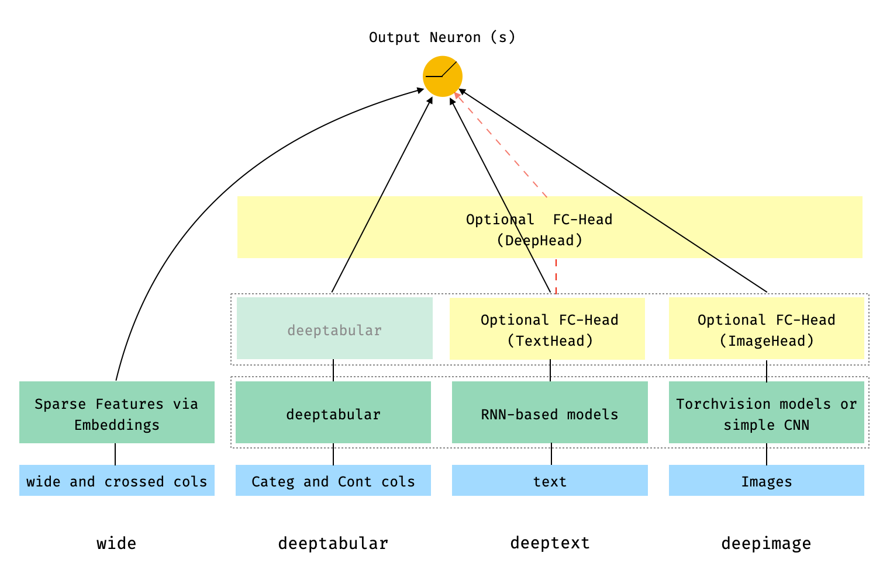

# Summary

In recent years datasets have grown both in size and diversity, combining different data types or modes. 
Multi-modal machine learning projects involving tabular data, images and/or text are gaining popularity[@garg2022multimodality].
Traditional approaches involved independent feature generation from every data mode and their combination in later stage, before passing them to an algorithm for classification or regression.

However, with the advent of "_easy-to-use_" Deep Learning (DL) frames such as Tensorflow [@tensorflow2015-whitepaper] or Pytorch [@NEURIPS2019_9015], and the subsequent advances in the fields of Computer Vision, Natural Language Processing or Deep Learning for Tabular data, it is now possible to use SoTA DL models and combine all datasets early in the process. This has two main advantages: (i) we can partially, even entirely, skip feature engineering, (ii) the representations of each data mode, ie. tabular, text and images, is learned jointly to harbor information that not only relates to the target, in the supervised training, but to how the different data modes relates to each other.

Furthermore, the flexibility inherent to DL approaches allows the usage of techniques that are primarly designed only for the text and/or images, to tabular data, eg. by transfer learning or self-supervised pre-training.

With that in mind, we introduce `pytorch-widedeep`, a flexible package for multimodal-deep-learning, designed to facilitate the combination of tabular data with text and images.

# Statement of need

There is a small number of packages available to use DL for tabular data alone (e.g pytorch-tabular [@joseph2021pytorch], pytorch-tabnet or autogluon-tabular [@erickson2020autogluon]) or that focus mainly in combining text and images (e.g. MMF [@singh2020mmf]). With that in mind, our goal is to provide a modular, flexible, "_easy-to-use_" frame that allows the combination of a wide variety of models for all data modes, tabular, text and images. Furthermore, our library offers also in-house developed models for tabular data, such as adaptations of the Perceiver [@jaegle2021perceiver] and the FastFormer [@chuhan2021fastformer] that, to the best of our knowledge, are not available in any other of the packages mentioned before.

`pytorch-widedeep` is based on Google's Wide and Deep Algorithm [@cheng2016wide], and hence its name. However, the library has evolved enormously since its origin and, while we prefer to preserve the name for a variety of reasons (the explanation of which is beyond the scope of this paper), the original algorithm is heavily adjusted for multi-modal datasets and intended to facilitate the combination of text and images with corresponding tabular data. With that in mind there are a number of architectures that can be implemented with just a few lines of code. The main components of those architectures are shown in the Figure \autoref{fig:widedeep_arch}.

The blue and green boxes in the figure represent the main data modes and their corresponding model components, namely `wide`, `deeptabular`, `deeptext` and `deepimage`. The yellow boxes represent _so-called_ fully-connected (FC) heads, simply MLPs that one can optionally add _"on top"_ of the main components. These are referred in the figure as `TextHead` and `ImageHead`. The dashed-line rectangles indicate that the outputs from the components inside are concatenated if a final FC head (referred as `DeepHead` in the figure) is used. The faded-green `deeptabular` box aims to indicate that the output of the deeptabular component will be concatenated directly with the output of the `deeptext` or `deepimage` components or, alternatively, with the FC heads if these are used. Finally, the arrows indicate the connections, which of course depend on the final architecture that the user chooses to build. For example, if a model comprised by a `deeptabular` and a `deeptext` component with no FC heads is used, the outputs of those components will be directly "plugged" into the output neuron or neurons (depending on whether this is a regression, binary classification or multi-class classification problem).

In math terms, and following the notation in the original paper [@cheng2016wide], the expression for the architecture without a `deephead` component can be formulated as:

$pred = \sigma(W_{wide}^{T}[x,\phi(x)] + W_{deeptabular}^{T}a_{deeptabular}^{l_f} + W_{deeptext}^{T}a_{deeptext}^{l_f} + W_{deepimage}^{l_f} + b)$

Where $W$ are the weight matrices applied to the wide model and to the final activations of the deep models, $a$ are these final activations, and $\phi(x)$ are the cross product transformations of the original features $x$. In case you are wondering what are _"cross product transformations"_, here is a quote taken directly from the paper: _"For binary features, a cross-product transformation (e.g., “AND(gender=female, language=en)”) is 1 if and only if the constituent features (“gender=female” and “language=en”) are all 1, and 0 otherwise"._

While if there is a `deephead` component, the previous expression turns into:

$pred = \sigma(W_{wide}^{T}[x,\phi(x)] + W_{deephead}^{T}a_{deephead}^{l_f} + b)$

At this stage it is worth mentioning that the library has been built with an special emphasis on flexibility. That is, we want users to easily run as many different models as possible and/or use their custom components if they prefer. With that in mind, each and every data mode component in the figure above can be used independently and in isolation. For example, if the user wants to use a ResNet model to perform classification in an image-only dataset, that is perfectly possible using this library. In addition, following some minor adjustments described in the documentation, the user can use any custom model for each data mode -- mainly a custom model is a standard Pytorch model class that must have a property or attribute called `output_dim`. This way the `WideDeep` collector class knows the size of the incoming activations and is able to construct the multi-modal model --. Examples on how to use custom components can be found in the repository and documentation.

# The Model Hub

In this section we will briefly introduce the current model components available for each data mode in the library. Bear in mind that the library is constantly under development and models are constantly added to the "model-hub".

## The `wide` component

This is a linear model for tabular data where the non-linearities are captured via cross-product transformations (see the description in the previous section). This is the simplest of all components and we consider it a very useful as benchmark when used it on its own.

## The `deeptabular` component

Currently, `pytorch-widedeep` offers the following models for the so called `deeptabular` component:(i) TabMlp, (ii) TabResnet, (iii) TabNet[@arik2021tabnet], (iv) ContextAttentionMLP[@yang2016hierarchical], (v) SelfAttentionMLP[@huang2020tabtransformer], (vi) TabTransformer[@huang2020tabtransformer], (vii) SAINT[@somepalli2021saint], (viii) FT-Transformer[@gorishniy2021revisiting], (ix) TabFastFormer: our adaptation of the FastFormer [@wu2021fastformer], (x) TabPerceiver: our adaptation of the Perceiver [@jaegle2021perceiver], (xi) BayesianWide and (xii) BayesianTabMlp.

## The `deepimage` component

The image related component is fully integrated with the newest version torchvision [@torchvision_models] (0.13 at the time of writing). This version has Multi-Weight Support [@torchvision_weight]. Therefore, a variety of model variants are available to use with pre-trained weights obtained with different datasets. Currently, the model variants supported by `pytorch-widedeep` are: (i) Resnet [@he2016deep], (ii) Shufflenet [@zhang2018shufflenet], (iii) Resnext [@xie2017aggregated], (iv) Wide Resnet [@zagoruyko2016wide], (v) Regnet [@xu2022regnet], (vi) Densenet [@huang2017densely], (vii) Mobilenet [@howard2017mobilenets], (viii) MNasnet [@tan2019mnasnet], (ix) Efficientnet [tan2019efficientnet] and (x) Squeezenet [@iandola2016squeezenet].

## The `deeptext` component

Currently, `pytorch-widedeep` offers the following models for the `deeptext` component: (i) BasicRNN, (ii) AttentiveRNN and (iii) StackedAttentiveRNN.

# Forms of model training:

Training single or multi-mode models in `pytorch-widedeep` is handled by the different training classes. Currently, `pytorch-widedeep` offers the following training options: (i) "_Standard_" Supervised, (ii) Supervised Bayesian and (iii) Self-supervised pre-training.
  
# Contribution

`Pytorch-widedeep` is being developed and used by many active community members. Anyone can join the discussion on slack [@pytorch_widedeep_slack]

# Acknowledgements

We acknowledge work of other researchers, engineers and programmers from following projects and libraries:

* the `Callbacks` and `Initializers` structure and code is inspired by the torchsample library [@torch_sample], which in itself partially inspired by Keras [@keras]
* the `TextProcessor` class in this library uses the fastai [@fastai_tokenizer] `Tokenizer` and `Vocab`; the code at `utils.fastai_transforms` is a minor adaptation of their code so it functions within this library; to our experience their `Tokenizer` is the best in class
* the `ImageProcessor` class in this library uses code from the fantastic Deep Learning for Computer Vision (DL4CV) [@dl4cv] book by Adrian Rosebrock
* we adjusted and integrated ideas of Label and Feature Distribution Smoothing [@yang2021delving]
* we adjusted and integrated ZILNloss code written in Tensorflow/Keras [@wang2019deep]

# References
