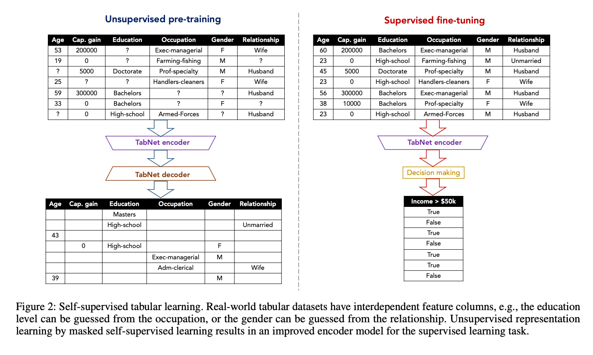
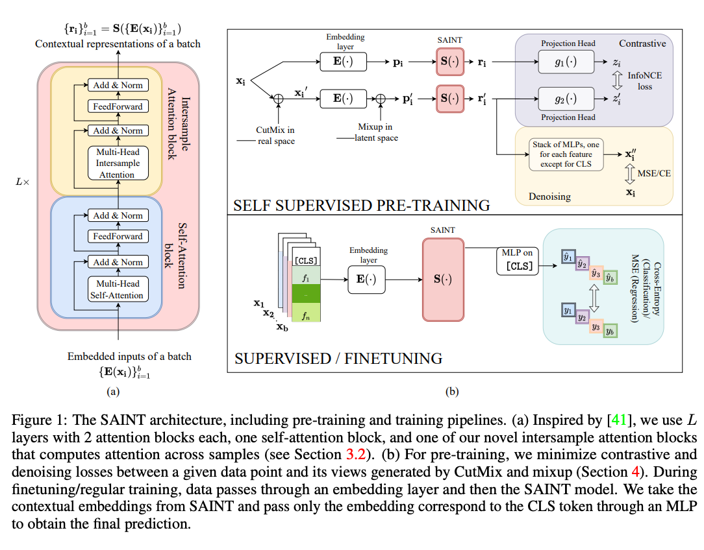

# Self Supervised Pre-training for tabular data

In this library we have implemented two methods or routines that allow the
user to use self-suerpvised pre-training for all tabular models in the library
with the exception of the `TabPerceiver` (this is a particular model and
self-supervised pre-training requires some adjustments that will be
implemented in future versions). Please see the examples folder in the repo
or the examples section in the docs for details on how to use self-supervised
pre-training with this library.

The two routines implemented are illustrated in the figures below. The first
is from [TabNet: Attentive Interpretable Tabular Learning](https://arxiv.org/abs/1908.07442).
It is a *'standard'* encoder-decoder architecture and and is designed here for
models that do not use transformer-based architectures (or when the
embeddings can all have different dimensions). The second is from
[SAINT: Improved Neural Networks for Tabular Data via Row Attention and
Contrastive Pre-Training](https://arxiv.org/abs/2203.05556), it is based on
Contrastive and Denoising learning and is designed for models that use
transformer-based architectures (or when the embeddings all need to have the
same dimension):

  

Figure 1. Figure 2 in their [paper](https://arxiv.org/abs/1908.07442). The
caption of the original paper is included in case it is useful.

  

Figure 2. Figure 1 in their [paper](https://arxiv.org/abs/2203.05556). The
caption of the original paper is included in case it is useful.

Note that the self-supervised pre-trainers described below focus, of course,
on the self-supervised pre-training phase, i.e. the left side in Figure 1 and
the upper part in Figure 2. When combined with the `Trainer` described
earlier in the documenation, one can reproduce the full process illustrated
in the figures above.

Also Note that it is beyond the scope of this docs to explain in detail these
routines. In addition, to fully utilise the self-supervised trainers
implemented in this library a minimum understanding of the processes as
described in the papers is required. Therefore, we strongly encourage the
users to have a look to the papers.

::: pytorch_widedeep.self_supervised_training.EncoderDecoderTrainer
    selection:
        filters:
            - "!^_"  # exclude all members starting with _
            - "!^explain"
            - "!^fit"

::: pytorch_widedeep.self_supervised_training.ContrastiveDenoisingTrainer
    selection:
        filters:
            - "!^_"  # exclude all members starting with _
            - "!^explain"
            - "!^fit"

